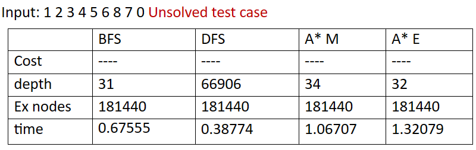
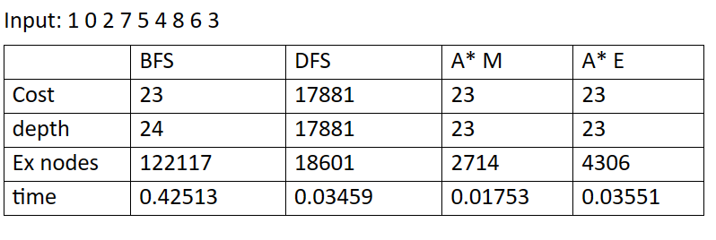
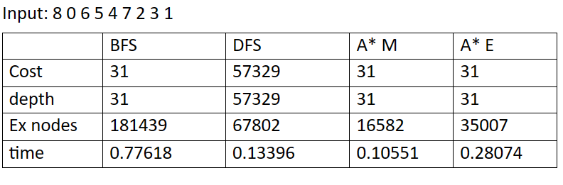
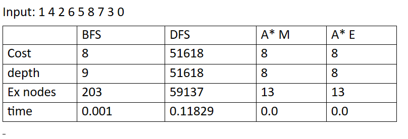
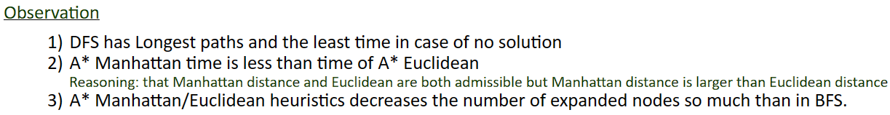

<!DOCTYPE html>
<html lang="en">
    <body>
        <h1>AI Search Algorithms</h1>
        
This project discuss the main differences between the
            different types of AI Search Algorithms like the completeness
            and the optimality of the algorithm.
            We used the 8-puzzle problem as an application that demonstrates
            these differences.
        

        

        <h2>Table of contents</h2>
        <ul>
            <li><a href="#dfs">Depth First Search</a></li>
            <li><a href="#bfs">Breadth First Search</a></li>
            <li><a href="#a-star-man">A* Search with Manhattan heuristic</a></li>
            <li><a href="#a-star-euc">A* Search with Euclidean heuristic</a></li>
            <li><a href="#comp">Test Cases & Comparisons</a></li>
        </ul>
        

        <h2 id="dfs">Depth First Search</h2>
        

            - Data Structure: Stack  
            - Completeness: Not complete  
            - Optimality: Not optimal  
            - Time: O(b ^ m)  
            - Space: O(b * m)  
            - b is the branching factor  
            - m is the maximum possible search tree depth  
            - DFS is good only when it comes to space complexity
        

        

        <h2 id="bfs">Breadth First Search</h2>
        

            - Data Structure: Queue  
            - Completeness: Complete  
            - Optimality: Optimal  
            - Time: O(b ^ s)  
            - Space: O(b ^ s)  
            - b is the branching factor  
            - s is the level where the goal state is present  
            - BFS is not very well dealing with space  
            - BFS can find the optimal solution only if all costs are equal to one
        

        

        <h2 id="a-star-man">A* Search with Manhattan heuristic</h2>
        

            - Data Structure: Priority Queue  
            - Completeness: Complete  
            - Optimality: Optimal  
            - A* Search Always finds the optimal solution  
            - A* Search considers the past cost and the upcoming heuristic cost  
            - Manhattan distance = |x1 - x2| + |y1 - y2|
        

        

        <h2 id="a-star-euc">A* Search with Euclidean heuristic</h2>
        

            - Data Structure: Priority Queue  
            - Completeness: Complete  
            - Optimality: Optimal  
            - A* Search Always finds the optimal solution  
            - A* Search considers the past cost and the upcoming heuristic cost  
            - Euclidean distance = sqrt((x1 - x2) ^ 2 + (y1 - y2) ^ 2)
        

        

        <h2 id="comp">Test Cases & Comparisons</h2>
         

         

         

         

         

        
    </body>
</html>